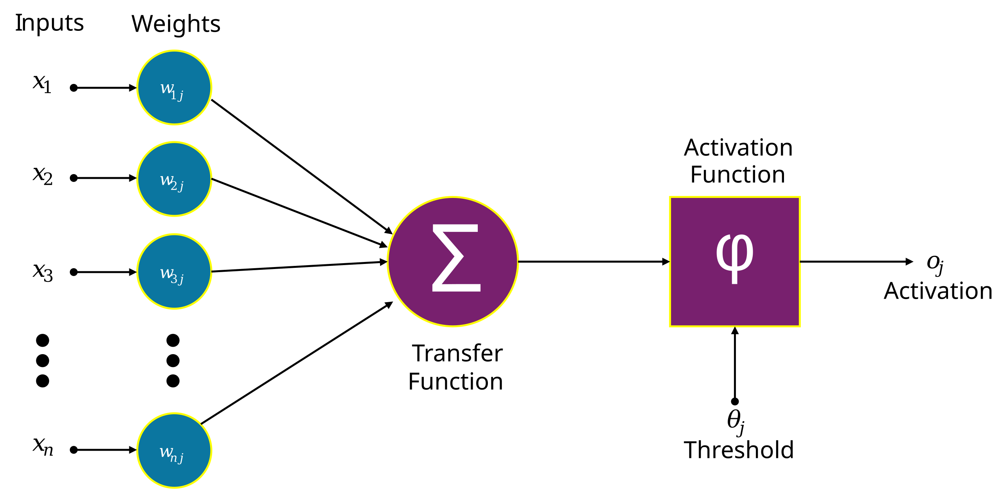
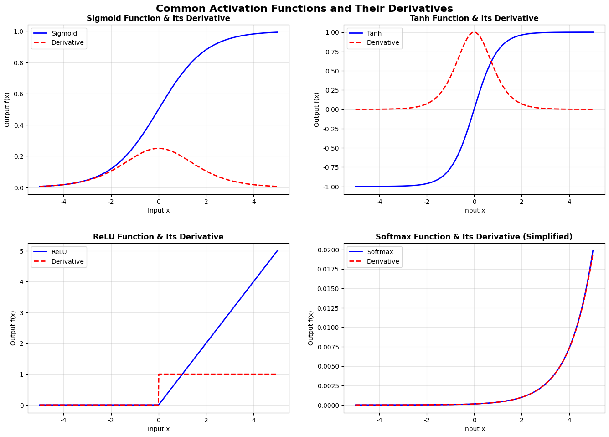
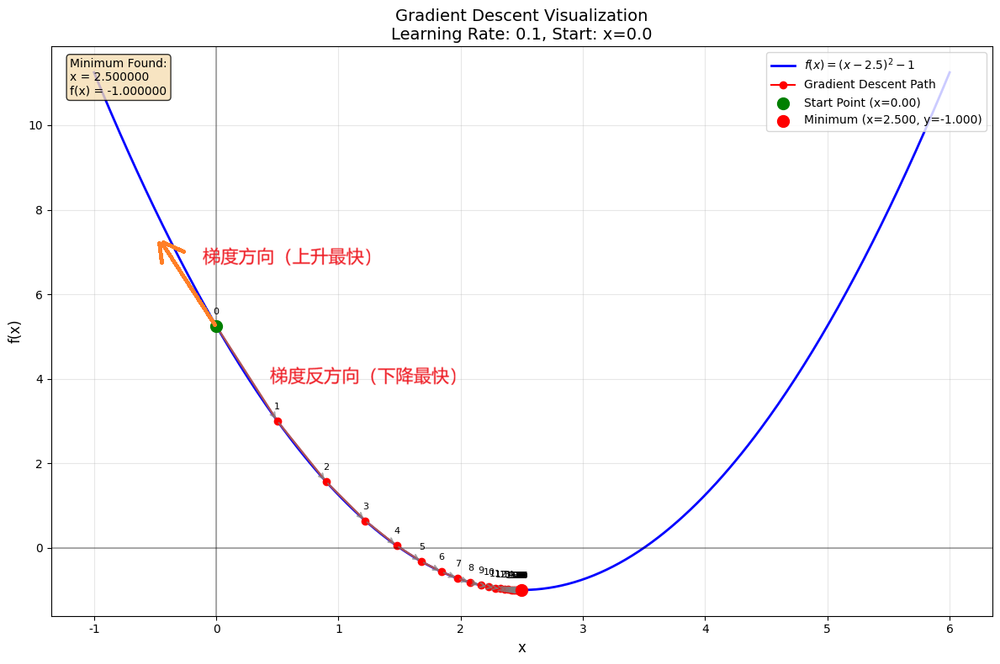

## 1 什么是人工神经网络？
人工神经网络是模拟生物学中神经网络的概念，构建的一组相互连接的节点（神经元），一般由输入层、隐藏层和输出层构成。在这里，每个节点代表一个人工神经元，而箭头则表示从一个人工神经元的输出端到另一个人工神经元输入端的连接。

### 1.1 神经元
要想了解整个神经网络，先要解释一下单个神经元。神经元是对一组数据输入进行加权求和，然后经过一个非线性激活函数输出结果的单元。

### 1.2 激活函数
激活函数是一个非线性函数，也只有是非线性的，才能在反向传播、更新参数的时候去拟合非线性关系。常见的激活函数有sigmoid、tanh、Relu

#### 1.2.1 Sigmoid函数

Sigmoid原函数：
$$
\sigma(x) = \frac{1}{1 + e^{-x}}
$$
sigmoid导函数:
$$
\sigma'(x) = \sigma(x) \left(1 - \sigma(x)\right)
$$

1. 函数行为特点

| 输入范围 | Sigmoid 函数行为 | Sigmoid 导数值 |
|---------|---------|--------|
| $ x \to -\infty $ | 趋近于0 | 趋近于0 |
| $ x = 0 $ | 等于0.5 | 最大值0.25 |
| $ x \to +\infty $ | 趋近于1 | 趋近于0 |

2. 优点分析​

平滑性: 函数连续可导，梯度变化平滑
概率解释: 输出值在(0, 1)区间，可以解释为概率，适合二分类问题

3. 缺点分析​

梯度消失问题: 当|x|较大时，梯度接近0，导致深层网络训练困难

#### 1.2.2 Tanh函数
tanh原函数：
$$
\tanh(x) = \frac{e^{x} - e^{-x}}{e^{x} + e^{-x}}
$$
tanh导函数：
$$
\tanh'(x) = 1 - \tanh^2(x)
$$

1. 函数行为特点

| 输入范围 | Tanh 函数行为 | Tanh 导数值 |
| :--- | :--- | :--- |
| $ x \to -\infty $ | 输出趋近于 -1 | 趋近于 0 |
| $ x = 0 $ | 输出为 0 | 达到最大值 1 |
| $ x \to +\infty $ | 输出趋近于 1 | 趋近于 0 |

2. 优点分析

平滑性: 函数连续可导，梯度变化平滑
零中心化输出：梯度更新更高效，收敛速度通常快于Sigmoid。
非线性能力强：适合处理对称分布的数据（如标准化后的数据）。

3. 缺点分析

梯度消失问题：当|x|较大时，梯度接近0，导致深层网络训练困难
计算成本较高：涉及指数运算，比ReLU慢。

4. 典型应用场景

循环神经网络（RNN/LSTM/GRU）的隐藏层。
需要输出正负值的场景（如情感分析、回归任务）。
中小规模网络的隐藏层。

#### 1.2.3 ReLU函数
ReLU原函数：
$$
\text{ReLU}(x) = \max(0, x)
$$

ReLU导函数：
$$
\text{ReLU}'(x) = 
\begin{cases} 
1 & \text{if } x > 0 \\
0 & \text{if } x \leq 0 
\end{cases}
$$

1. 函数行为特点

| 输入范围 | ReLU 函数行为 | ReLU 导数值 |
| :--- | :--- | :--- |
| $ x < 0 $ | 输出为 0 | 等于 0 |
| $ x = 0 $) | 输出为 0 | 不可导（在实现中通常按0或1处理） |
| $ x > 0 $) | 输出等于输入 $x$ | 等于 1 |

2. 优点分析

缓解梯度消失：在正区间梯度恒为1，支持深层网络训练。
计算高效：仅需比较和取正，速度远快于Sigmoid/Tanh。
稀疏激活性：负输入导致神经元静默，模拟生物神经元的稀疏特性，提升模型泛化能力。

3. 缺点分析
在负区间无梯度：无法学习负输入特征
神经元死亡：一旦输入为负，梯度永久为0，对应神经元可能永远无法激活。

## 2 如何训练一个人工神经网络？
人工神经网络无非也是一个模型，和传统的机器学习的思路一致，也是通过**拟合既有数据**来不断迭代**优化模型参数**，可以参考jalammar的[文章](https://jalammar.github.io/feedforward-neural-networks-visual-interactive/)。

+ 拟合数据的过程中，需要度量模型预测结果与真实结果之间的差距，也就是**损失函数**。
+ 确定损失函数后，需要优化算法确定参数更新的方向，也就是**梯度下降算法**。
+ 根据特征从前往后计算预测结果的过程称为**前向传播**，根据预测结果计算损失函数的梯度过程称为**反向传播**。我们还需要了解反向传播过程中如何通过**链式法则**来计算梯度的。

### 2.1 损失函数
损失函数是度量预测值和真实值差距的函数，需要根据不同的预测任务去选择不同的函数。

回归任务中，常见的损失函数有均方误差/MSE（Mean Squared Error）、平均绝对误差/MAE（Mean Absolute Error）、均方根误差/RMSE（Root Mean Square Error）

分类任务中，常见的损失函数有二分类交叉熵（Binary Cross-Entropy Loss）、交叉熵（Cross-Entropy Loss）。

#### 2.1.1 MSE
均方误差:预测值与真实值之间的偏差的平方的平均值, 也叫L2 loss函数。

$$
 \text{MSE} = \frac{1}{n} \sum_{i=1}^{n} (y_i - \hat{y}_i)^2
$$

#### 2.1.2 MAE
平均绝对误差:预测值与真实值之间的偏差的绝对值的平均值，也叫L1 loss函数。

$$
 \text{MAE} = \frac{1}{n} \sum_{i=1}^{n} |y_i - \hat{y}_i|
$$

#### 2.1.3 RMSE
均方根误差:是MSE的平方根。

$$
 \text{RMSE} = \sqrt{\frac{1}{n} \sum_{i=1}^{n} (y_i - \hat{y}_i)^2}
$$

#### 2.1.4 BCE
二分类交叉熵损失:衡量两个独立概率​ (是/否) 与真实标签的差异

$$
 \text{BCE} = -\frac{1}{n} \sum_{i=1}^{n} \left[ y_i \log(\hat{y}_i) + (1 - y_i) \log(1 - \hat{y}_i) \right]
$$
- $n$ 表示样本的个数
- $y_i$ 表示真实标签（0或1）
- $\hat{y}_i$ 预测标签的概率

#### 2.1.5 CE
交叉熵损失:衡量一个概率分布与真实分布之间的差异
$$
 \text{CE} = -\frac{1}{n} \sum_{i=1}^{n} \sum_{j=1}^{C} y_{ij} \log(\hat{y}_{ij})
$$
- $n$ 表示样本的个数
- $y_{ij}$ 表示样本$i$是否为类别$j$（0或1）
- $\hat{y}_{ij}$ 预测样本$i$为类别$j$的概率

### 2.2 梯度下降算法

#### 2.2.1梯度下降算法的含义
梯度下降算法是寻找模型参数的调整方向，使得损失函数能更快地下降，也就是预测值更贴近真实值的方向。而一个函数在某一点的导数的方向是该点上升最快的方向，而梯度是一个向量，它由函数在每个参数方向上的偏导数构成，所以梯度的反方向是下降最快的方向。因此，梯度下降算法就是求得损失函数的梯度，让模型参数沿着梯度反方向进行更新，以求模型预测效果更好。

#### 2.2.2数学表达
梯度下降算法的数学表达如下：
$$
\theta_{t+1} = \theta_t - \alpha \nabla_\theta \mathcal{L}(\theta_t)
$$
- $\theta_t$ 表示模型参数在第t步的取值
- $\alpha$ 学习率，控制模型参数更新的大小
- $\mathcal{L}(\theta_t)$ 损失函数在第t步的取值
- $\nabla_\theta \mathcal{L}(\theta_t)$ 损失函数在第t步对模型参数的梯度

#### 2.2.3 梯度下降算法的分类
梯度下降算法根据计算梯度时的样本量的不同，分成三种：批量梯度下降、小批量梯度下降、随机梯度下降。
+ 批量梯度下降：每次迭代都使用所有样本计算梯度，然后更新模型参数。
+ 小批量梯度下降：每次迭代都使用一部分样本计算梯度，然后更新模型参数。
+ 随机梯度下降：每次迭代都使用一个样本计算梯度，然后更新模型参数。

#### 2.2.4 梯度下降算法的挑战
梯度下降面临一系列[挑战](https://www.ibm.com/think/topics/gradient-descent)：

+ 局部最小值和鞍点

对于凸优化问题，梯度下降可以很容易找到全局最小值；但非凸优化的情况下，局部梯度为0或者趋近于0，出现局部极小值和鞍点的情况，梯度下降可能很难找到全局最小值。

+ 梯度消失和梯度爆炸
梯度消失情况下，收敛到局部最小值或者鞍点。梯度爆炸情况下，模型权重会变得过大，最终表示为 NaN，模型无法收敛。

#### 2.2.5 梯度下降算法的进阶优化
应对上述挑战，以合理的方式调整学习率和梯度，一定程度上能环节这些问题。这些进阶优化方法有动量法、AdaGrad、RMSprop、Adam，可以参考[这篇解释](https://zhuanlan.zhihu.com/p/1934951747912197128)

##### 动量法（Momentum）
动量法将梯度与上一次迭代的梯度进行加权平均，以获得当前迭代的梯度，相当于考虑了历史梯度的影响，获得了一定的梯度"惯性"。对梯度方向变化频繁的情况，趋于保守。
$$
v_t = \beta v_{t-1} + (1 - \beta) \nabla_\theta J(\theta_t)
$$
$$
\theta_{t+1} = \theta_t - \eta v_t
$$
- $\beta$ 动量参数，控制历史梯度的权重
- $\eta$ 学习率
- $v_t$ 动量向量
- $\theta_t$ 模型参数在第t步的取值
- $\nabla_\theta J(\theta_t)$ 损失函数在第t步对模型参数的梯度

##### AdaGrad
AdaGrad是根据梯度值动态调整学习率，当梯度平方和累计越大时，其学习率越小；反之，学习率会增大，能够一定程度缓解了梯度消失与梯度爆炸问题。
$$
G_t = G_{t-1} + (\nabla_\theta J(\theta_t))^2
$$
$$
\theta_{t+1} = \theta_t - \frac{\eta}{\sqrt{G_t} + \epsilon} \nabla_\theta J(\theta_t)
$$
- $G_t$ 梯度的平方和
- $\eta$ 学习率
- $\epsilon$ 一个很小的数，用于避免除零
- $\theta_t$ 模型参数在第t步的取值
- $\nabla_\theta J(\theta_t)$ 损失函数在第t步对模型参数的梯度

##### RMSprop
RMSprop将梯度的平方进行加权平均，以调整学习率，将AdaGrad中梯度平方的累加变成了加权平均。
$$
E[g^2]_t = \beta E[g^2]_{t-1} + (1 - \beta)(\nabla_\theta J(\theta_t))^2
$$
$$
\theta_{t+1} = \theta_t - \frac{\eta}{\sqrt{E[g^2]_t} + \epsilon} \nabla_\theta J(\theta_t)
$$
- $E[g^2]_t$ 梯度的平方的加权平均
- $\eta$ 学习率
- $\epsilon$ 一个很小的数，用于避免除零
- $\theta_t$ 模型参数在第t步的取值
- $\nabla_\theta J(\theta_t)$ 损失函数在第t步对模型参数的梯度

##### Adam
Adam结合了动量法和RMSprop，分别对计算得到的梯度及其平方梯度进行指数移动平均。
$$
m_t = \beta_1 m_{t-1} + (1 - \beta_1) g_t
$$
$$v_t = \beta_2 v_{t-1} + (1 - \beta_2) g_t^2$$
$$\hat{m}_t = \frac{m_t}{1 - \beta_1^t}$$
$$\hat{v}_t = \frac{v_t}{1 - \beta_2^t}$$
$$\theta_{t+1} = \theta_t - \eta \cdot \frac{\hat{m}_t}{\sqrt{\hat{v}_t} + \epsilon}$$
- $m_t$ 梯度的指数移动平均
- $v_t$ 梯度的平方的指数移动平均
- $\hat{m}_t$ 梯度的指数移动平均的修正
- $\hat{v}_t$ 梯度的平方的指数移动平均的修正
- $\eta$ 学习率
- $\epsilon$ 一个很小的数，用于避免除零
- $\theta_t$ 模型参数在第t步的取值
- $g_t$ 梯度
- $\nabla_\theta J(\theta_t)$ 损失函数在第t步对模型参数的梯度

### 2.3 前向传播和反向传播
关于前向传播和反向传播的说明，李沐老师的[《动手学深度学习》](https://zh-v1.d2l.ai/chapter_deep-learning-basics/backprop.html)比较清晰。

因为神经网络是由多层堆叠而成，前一层的输出是后一层的输入，因此，反向传播算法的思路是，从输出层开始，计算输出层到隐藏层的梯度，然后，逐层逆向从后往前计算梯度。实际上就是可以视为复合函数求导的过程，前一层的参数求导需要用到后一层的参数求导结果，后一层参数求导相当于前一层参数的内函数求导。

## 3. 代码实现
[Demo练习](../notebook/A01_Artificial_neural_network/pytorch_quickstart.ipynb)来自于pytorch官方文档的[quickstart](https://docs.pytorch.org/tutorials/beginner/basics/quickstart_tutorial.html)示例代码，展示了使用包含三个线性层的神经网络进行图像分类的例子。这个例子包含了训练、测试、保存和加载模型等步骤：
+ 构建train和test的dataset和dataloader
+ 构建模型，三个线性层，使用relu激活函数
+ 构建损失函数（cross entropy loss）和优化器 （Adam）
+ 训练模型，使用训练集进行训练，使用测试集进行测试
+ 保存模型
+ 加载模型并预测