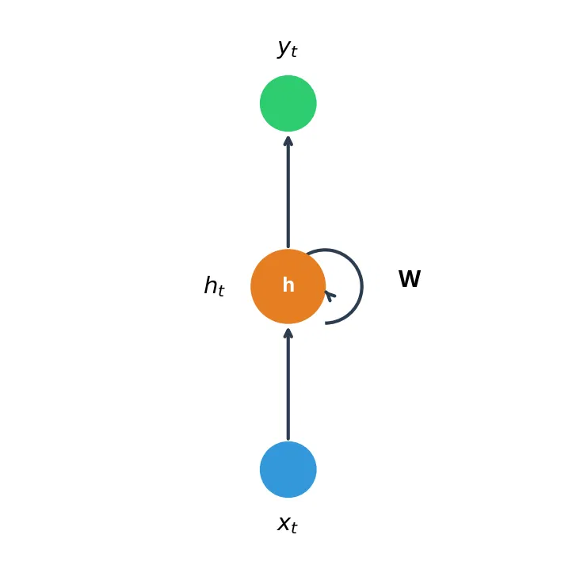
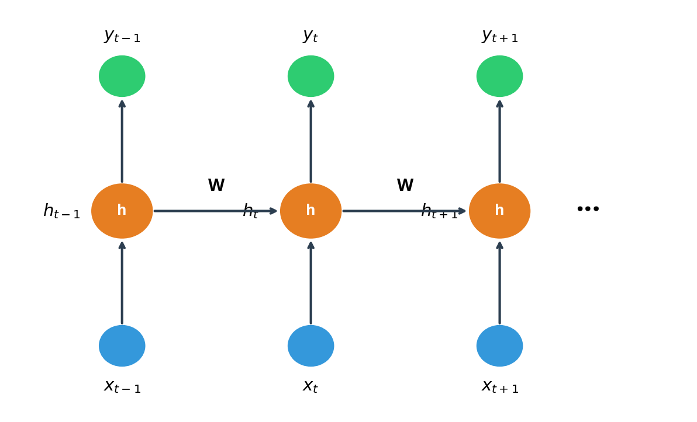
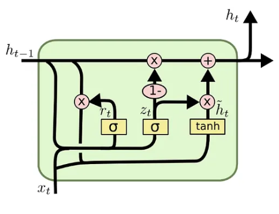

## 1 RNN
### 1.1 概念
RNN(Recurrent Neural Network)即循环神经网络，在内部维护一个隐藏状态，用于捕获序列直到当前时间步的历史信息，上一时间步输出的隐藏状态又作为了下一时间步的部分输入。

### 1.2 公式
当前时间步的隐藏状态：
$$
h_t = \tanh(W_{xh} x_t + W_{hh} h_{t-1} + b_h)
$$
当前时间步的输出：
$$
y_t = W_{hy} h_t + b_y
$$

### 1.3 特点
在训练长序列时，存在梯度消失或梯度爆炸问题，导致基本RNN难以学习长期依赖关系

## 2 LSTM

### 2.1 概念
LSTM(Long Short-Term Memory)是一种特殊的RNN结构，专门设计用于学习长期依赖关系。通过引入记忆单元(Cell State)和三个门机制(输入门、遗忘门、输出门)，LSTM能够有效控制信息的流动，解决基本RNN的梯度消失问题。

### 2.2 公式
遗忘门(决定丢弃多少信息)：
$$
f_t = \sigma(W_f \cdot [h_{t-1}, x_t] + b_f)
$$

输入门(决定新增多少信息)：
$$
i_t = \sigma(W_i \cdot [h_{t-1}, x_t] + b_i)
$$

候选记忆(新的记忆内容)：
$$
\tilde{C}_t = \tanh(W_C \cdot [h_{t-1}, x_t] + b_C)
$$

记忆单元更新：
$$
C_t = f_t \odot C_{t-1} + i_t \odot \tilde{C}_t
$$

输出门(决定输出多少信息)：
$$
o_t = \sigma(W_o \cdot [h_{t-1}, x_t] + b_o)
$$

隐藏状态：
$$
h_t = o_t \odot \tanh(C_t)
$$

其中$\sigma$表示sigmoid函数，$\odot$表示逐元素乘积。

### 2.3 特点
- 通过门机制精细控制信息流动，有效缓解梯度消失问题
- 能够学习长期依赖关系
- 参数量相对较多，计算复杂度高

## 3 GRU

### 3.1 概念
GRU(Gated Recurrent Unit)是LSTM的简化版本，同样使用门机制来控制信息流动。相比LSTM，GRU只有两个门(重置门和更新门)，结构更简洁，计算效率更高，同时在很多任务上性能相当。

### 3.2 公式
重置门(决定保留多少过去信息)：
$$
r_t = \sigma(W_r \cdot [h_{t-1}, x_t] + b_r)
$$

更新门(决定新旧信息的权重)：
$$
z_t = \sigma(W_z \cdot [h_{t-1}, x_t] + b_z)
$$

候选隐藏状态：
$$
\tilde{h}_t = \tanh(W_h \cdot [r_t \odot h_{t-1}, x_t] + b_h)
$$

隐藏状态更新：
$$
h_t = (1 - z_t) \odot \tilde{h}_t + z_t \odot h_{t-1}
$$

### 3.3 特点
- 结构比LSTM简洁，参数更少
- 计算速度更快，训练效率高
- 在多数序列任务上性能与LSTM相当
- 适用于数据量有限或计算资源有限的场景