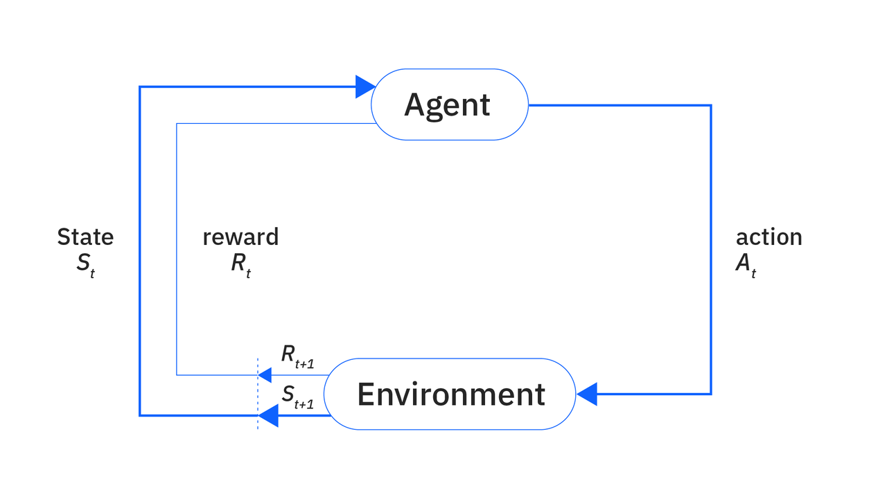

## 1 什么是强化学习？

强化学习是设定一个奖励函数，针对智能体在某个环境状态的行为进行奖励或者惩罚，从而让智能体学习到一个最优策略的一种机器学习方法。

它本质上是智能体、环境、奖励函数三者之间的交互关系，可以理解为以下的马尔可夫决策过程：

强化学习包括以下[几个部分](https://towardsdatascience.com/deep-reinforcement-learning-for-dummies/)：

- Agent:智能体，根据环境状态和奖励进行决策的主体。

- Environment:智能体所在的真实或虚拟的世界。

- Policy:智能体的决策策略，即智能体根据环境状态的输入，输出一个动作。

- State:智能体所在环境状态特征。

- Reward:智能体在产生某个动作后所获得的奖励或惩罚。